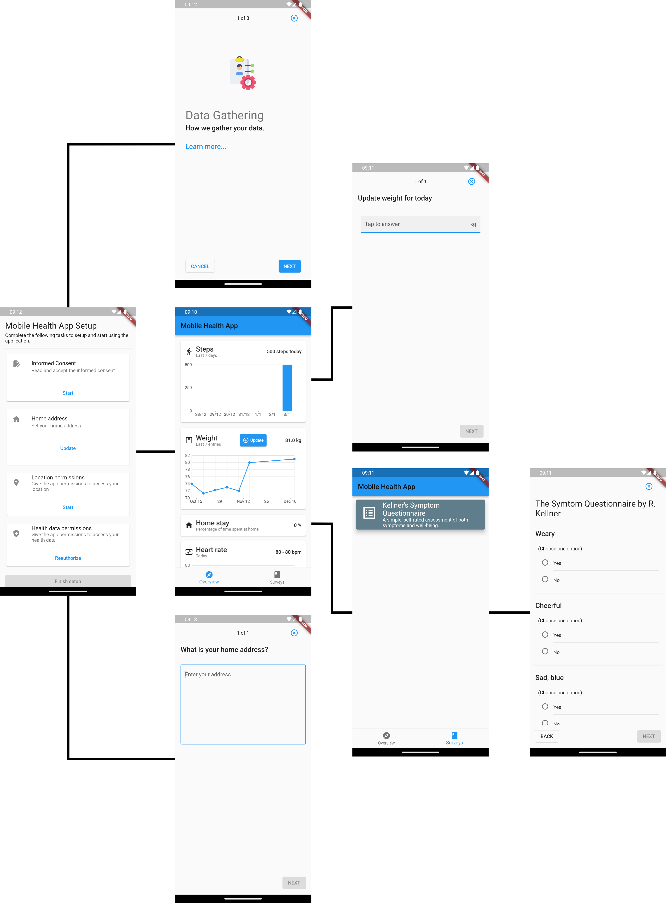

# flutter_health_app
This repository contains the codebase for the our Bachelor thesis. The aim of the project is to create the initial version of an mobile application for iOS and Android that utilizes mobile sensors and surveys. It aims to collect health-related information from individuals undergoing dose tapering of depression medication. The ultimate goal is to gather this data and employ machine learning to predict their next dosage adjustment. The prediction process considers their reported symptoms and health information.

## Main Features
* Integrates with mobile sensors and health app for  health-related data collection.
* Incorporates an questionnaire system that allows a diverse range of questionnaire types
* Presents collected information to users in a clear and user-friendly interface.
* Facilitates the extraction of collected data, supporting integration with analytics platforms

## Technologies Used
The project utilizes Flutter as the primary technology for creating the application. Additionally, components from the Copenhagen Research Platform (CARP) have been used.

## Getting Started
To run the application, connect a compatible device — either an iOS or Android device or use an emulator. Follow these steps to begin:

1.  **Clone the Repository:**
    
    ```
    git clone https://github.com/mikklf/flutter_health_app 
    cd flutter_health_app
    ```
    
2.  **Install Dependencies:**
    
    `flutter pub get`
    
3.  **Run the Application:**
    
    `flutter run`

## Screen Flow Diagram

The screen flow diagram includes all the pages that a regular user will encounter.

